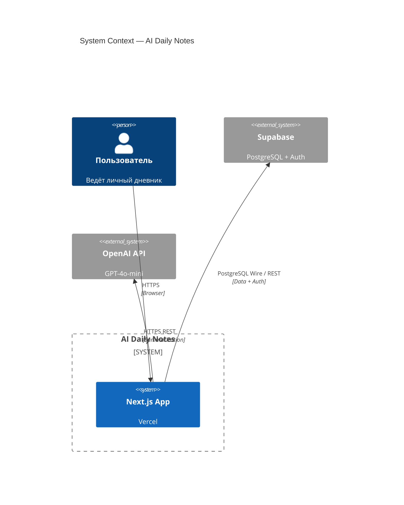
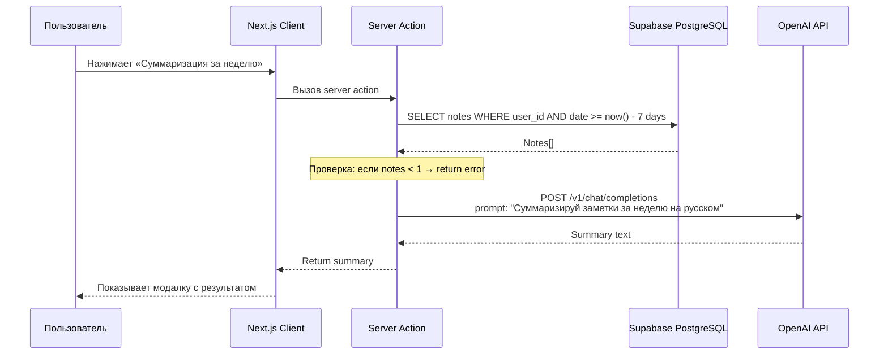
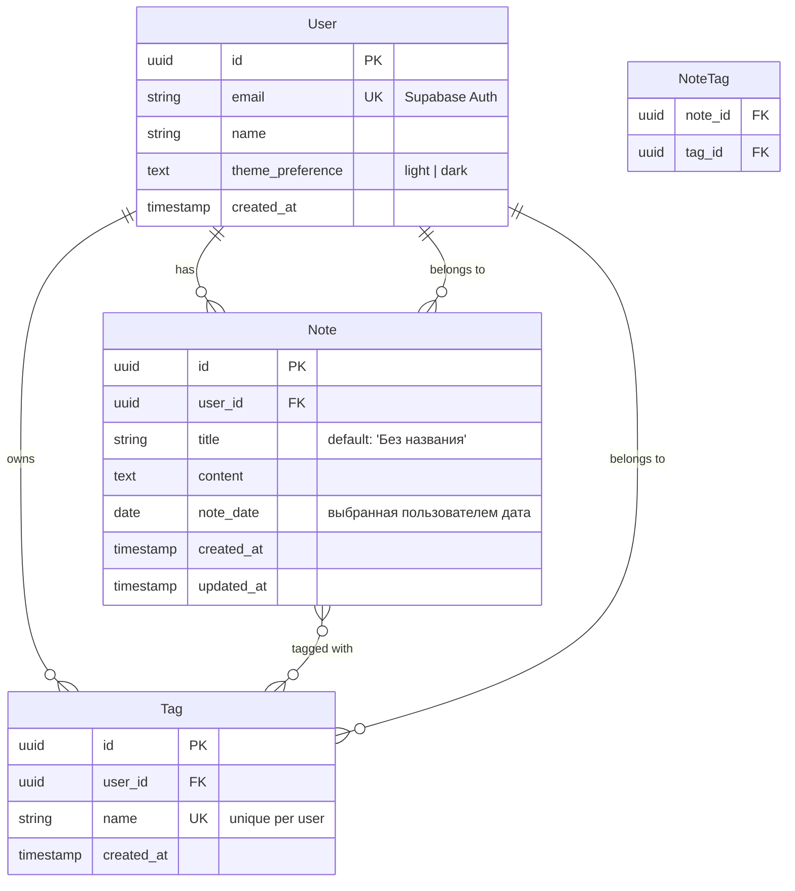

# Architecture Document — AI Daily Notes (MVP)

## 1. Architecture Analysis

### Ключевые требования, влияющие на архитектуру
- **Single-user personal app** — не нужна сложная multi-tenant архитектура
- **AI-функция** — интеграция с OpenAI API требует serverless-функций или edge functions
- **Supabase Auth** — аутентификация вынесена в managed service
- **Vercel deployment** — serverless-first подход
- **Минимализм** — простота и скорость разработки важнее масштабируемости

### Архитектурные варианты

| Вариант | Описание | Плюсы | Минусы | Вердикт |
|---------|----------|-------|--------|---------|
| **1. Next.js App Router (Monolithic)** | Всё в одном Next.js: React Server Components + API Routes + Server Actions | • Один деплой<br>• Быстрая разработка<br>• Server Components = 0 JS на клиенте<br>• RLS + Server Actions = безопасность | • Связанные frontend/backend<br>• Нет изоляции API | ✅ **Рекомендован для MVP** |
| 2. Next.js + Express API | Next.js frontend + отдельный Express backend на Vercel | • Чистое разделение<br>• Независимое масштабирование | • Два деплоя<br>• Overkill для single-user<br>• Больше инфраструктуры | ❌ Избыточно для MVP |
| 3. Next.js + tRPC | Type-safe API через tRPC | • End-to-end type safety<br>• Отличный DX | • Кривая обучения<br>• Меньше примеров | ❌ Добавляет сложность без острой необходимости |

**Итог: Вариант 1 — Next.js App Router Monolithic**

---

## 2. Tech Stack

| Слой | Технология | Обоснование |
|------|-----------|-------------|
| **Framework** | Next.js 14+ (App Router) | React Server Components, Server Actions, API Routes — всё в одном |
| **Language** | TypeScript | Type safety на всём стеке |
| **Database** | Supabase (PostgreSQL) | Managed Postgres, RLS policies, realtime |
| **Auth** | Supabase Auth | Email/password из коробки, сессии, RLS интеграция |
| **ORM** | Supabase JS Client (raw SQL) | Лёгкий, без лишних абстракций; TypeScript генерация типов через `supabase gen types` |
| **AI** | OpenAI API (GPT-4o-mini) | Быстрый, дешёвый, достаточен для суммаризации |
| **Styling** | Tailwind CSS | Utility-first, минималистичный, быстрая разработка |
| **Deployment** | Vercel | Serverless, автоматический деплой из GitHub, edge network |
| **UI Components** | shadcn/ui | На основе Tailwind + Radix, минималистичные компоненты |
| **Theme** | next-themes | Переключение dark/light, localStorage persistence |

---

## 3. System Architecture Diagram

### Level 1: System Context (C4)



### Level 2: Container Diagram

```mermaid
C4Container
    title Container Diagram — AI Daily Notes

    Person(user, "Пользователь", "Browser")

    System_Boundary(nextjs, "Next.js (Vercel)") {
        Container(next_app, "Next.js App", "React Server Components", "UI rendering, Server Actions")
        Container(api_routes, "API Routes", "Serverless Functions", "REST endpoints for AI + Export")
        Container(server_actions, "Server Actions", "Next.js 14+", "CRUD operations via Supabase client")
    }

    System_Ext(supabase, "Supabase") {
        ContainerDb(pg, "PostgreSQL", "Database", "Notes, Tags, Users")
        Container(auth, "Supabase Auth", "Auth Service", "Registration, Login, Session")
    }

    System_Ext(openai, "OpenAI API", "GPT-4o-mini")

    Rel(user, next_app, "HTTPS", "Pages")
    Rel(next_app, server_actions, "Server Actions")
    Rel(server_actions, pg, "SQL", "RLS-protected")
    Rel(api_routes, openai, "HTTPS", "Summarize")
    Rel(api_routes, auth, "HTTP", "Auth flow")
```

### Level 3: Data Flow — AI Summarization



---

## 4. Database Schema (ERD)



### SQL (Supabase)

```sql
-- Таблицы создаются через Supabase Studio или миграцию

CREATE TABLE note (
  id          UUID DEFAULT gen_random_uuid() PRIMARY KEY,
  user_id     UUID NOT NULL REFERENCES auth.users(id) ON DELETE CASCADE,
  title       TEXT NOT NULL DEFAULT 'Без названия',
  content     TEXT NOT NULL DEFAULT '',
  note_date   DATE NOT NULL DEFAULT CURRENT_DATE,
  created_at  TIMESTAMPTZ NOT NULL DEFAULT NOW(),
  updated_at  TIMESTAMPTZ NOT NULL DEFAULT NOW()
);

CREATE TABLE tag (
  id          UUID DEFAULT gen_random_uuid() PRIMARY KEY,
  user_id     UUID NOT NULL REFERENCES auth.users(id) ON DELETE CASCADE,
  name        TEXT NOT NULL,
  created_at  TIMESTAMPTZ NOT NULL DEFAULT NOW(),
  UNIQUE(user_id, name)
);

CREATE TABLE note_tag (
  note_id     UUID NOT NULL REFERENCES note(id) ON DELETE CASCADE,
  tag_id      UUID NOT NULL REFERENCES tag(id) ON DELETE CASCADE,
  PRIMARY KEY (note_id, tag_id)
);

-- Indexes
CREATE INDEX idx_note_user_date ON note(user_id, note_date DESC);
CREATE INDEX idx_note_user_search ON note USING GIN(to_tsvector('russian', title || ' ' || content));
CREATE INDEX idx_tag_user ON tag(user_id);
CREATE INDEX idx_note_tag_tag ON note_tag(tag_id);

-- RLS Policies (ключевой элемент безопасности)
ALTER TABLE note ENABLE ROW LEVEL SECURITY;
ALTER TABLE tag ENABLE ROW LEVEL SECURITY;
ALTER TABLE note_tag ENABLE ROW LEVEL SECURITY;

CREATE POLICY user_owns_note ON note
  FOR ALL USING (auth.uid() = user_id);

CREATE POLICY user_owns_tag ON tag
  FOR ALL USING (auth.uid() = user_id);

CREATE POLICY user_owns_note_tag ON note_tag
  FOR ALL USING (
    EXISTS (SELECT 1 FROM note WHERE id = note_id AND user_id = auth.uid())
  );
```

---

## 5. API Endpoints

### REST API (API Routes)

| Method | Endpoint | Auth | Описание |
|--------|----------|------|----------|
| `POST` | `/api/auth/register` | No | Регистрация (делегируется Supabase Auth) |
| `POST` | `/api/auth/login` | No | Вход |
| `POST` | `/api/auth/logout` | Yes | Выход |
| | | | |
| `GET` | `/api/notes?date=YYYY-MM-DD` | Yes | Заметки за дату |
| `POST` | `/api/notes` | Yes | Создать заметку |
| `GET` | `/api/notes/[id]` | Yes | Получить заметку |
| `PATCH` | `/api/notes/[id]` | Yes | Обновить заметку |
| `DELETE` | `/api/notes/[id]` | Yes | Удалить заметку |
| `GET` | `/api/notes/search?q=text` | Yes | Поиск по тексту |
| `GET` | `/api/notes/[id]/export` | Yes | Экспорт в Markdown (.md file) |
| | | | |
| `GET` | `/api/tags` | Yes | Список тегов пользователя |
| `POST` | `/api/tags` | Yes | Создать тег |
| `DELETE` | `/api/tags/[id]` | Yes | Удалить тег |
| | | | |
| `POST` | `/api/notes/[id]/tags` | Yes | Прикрепить теги к заметке |
| `DELETE` | `/api/notes/[id]/tags/[tagId]` | Yes | Открепить тег от заметки |
| | | | |
| `POST` | `/api/ai/summarize` | Yes | AI-суммаризация за неделю |

### Server Actions (альтернатива REST для CRUD)

Для операций внутри приложения (CRUD заметок/тегов) используем **Server Actions** вместо REST — они позволяют вызывать бизнес-логику напрямую из компонентов без лишних HTTP-запросов. REST API остаётся для AI, экспорта и внешней интеграции.

---

## 6. Project Structure

```
smart-ai-tracker/
├── src/
│   ├── app/
│   │   ├── layout.tsx              # Root layout (ThemeProvider, AuthProvider)
│   │   ├── page.tsx                 # Redirect → /today or /login
│   │   │
│   │   ├── (auth)/
│   │   │   ├── login/
│   │   │   │   └── page.tsx
│   │   │   └── register/
│   │   │       └── page.tsx
│   │   │
│   │   ├── (dashboard)/
│   │   │   ├── layout.tsx           # Sidebar/Header, date navigation
│   │   │   ├── page.tsx             # Сегодняшние заметки (redirect to today)
│   │   │   ├── day/
│   │   │   │   └── [date]/
│   │   │   │       └── page.tsx     # Заметки за выбранную дату
│   │   │   ├── notes/
│   │   │   │   ├── new/
│   │   │   │   │   └── page.tsx     # Создание заметки
│   │   │   │   └── [id]/
│   │   │   │       └── page.tsx     # Просмотр / редактирование
│   │   │   └── search/
│   │   │       └── page.tsx         # Поиск с результатами
│   │   │
│   │   └── api/
│   │       ├── auth/
│   │       │   ├── register/route.ts
│   │       │   ├── login/route.ts
│   │       │   └── logout/route.ts
│   │       ├── notes/
│   │       │   ├── route.ts         # GET (list), POST
│   │       │   ├── [id]/
│   │       │   │   ├── route.ts     # GET, PATCH, DELETE
│   │       │   │   └── export/route.ts
│   │       │   └── search/route.ts
│   │       ├── tags/
│   │       │   ├── route.ts
│   │       │   └── [id]/route.ts
│   │       ├── notes/[id]/tags/
│   │       │   └── route.ts
│   │       └── ai/
│   │           └── summarize/route.ts
│   │
│   ├── components/
│   │   ├── ui/                      # shadcn/ui components
│   │   │   ├── button.tsx
│   │   │   ├── input.tsx
│   │   │   ├── dialog.tsx
│   │   │   └── ...
│   │   ├── layout/
│   │   │   ├── sidebar.tsx
│   │   │   ├── header.tsx
│   │   │   └── theme-toggle.tsx
│   │   ├── notes/
│   │   │   ├── note-card.tsx
│   │   │   ├── note-editor.tsx
│   │   │   └── note-list.tsx
│   │   ├── tags/
│   │   │   ├── tag-input.tsx
│   │   │   ├── tag-badge.tsx
│   │   │   └── tag-filter.tsx
│   │   ├── calendar/
│   │   │   └── date-picker.tsx
│   │   └── ai/
│   │       └── summary-modal.tsx
│   │
│   ├── lib/
│   │   ├── supabase/
│   │   │   ├── client.ts            # Browser client
│   │   │   └── server.ts            # Server-side client (service role)
│   │   ├── openai.ts
│   │   └── utils.ts
│   │
│   ├── actions/                     # Server Actions
│   │   ├── notes.ts
│   │   ├── tags.ts
│   │   └── auth.ts
│   │
│   └── types/
│       └── index.ts                 # TypeScript types (generated from Supabase)
│
├── public/
├── supabase/
│   └── migrations/                  # SQL миграции
├── .env.local                       # SUPABASE_URL, SUPABASE_ANON_KEY, OPENAI_API_KEY
├── next.config.js
├── tailwind.config.ts
└── package.json
```

---

## 7. Architecture Decision Records (ADR)

### ADR-001: Next.js App Router over Pages Router

**Контекст:** Выбор маршрутизатора для Next.js.

**Решение:** Используем App Router (Next.js 14+).

**Обоснование:**
- React Server Components — меньше JS на клиенте, быстрее загрузка
- Server Actions — встроенные мутации без написания API ручек для CRUD
- Layout-система — вложенные layout'ы для auth/dashboard разделения
- Будущее Next.js — Pages Router в режиме поддержки

**Последствия:** Нужно изучить Server Actions, но для MVP это оправдано.

---

### ADR-002: Server Actions for CRUD, REST for AI/Export

**Контекст:** Как реализовывать мутации данных.

**Решение:** CRUD заметок и тегов — через Server Actions. AI-суммаризация и экспорт — через REST API Routes.

**Обоснование:**
- Server Actions вызываются напрямую из компонентов, меньше boilerplate
- REST нужен для AI (отдельный endpoint с timeout) и экспорта (скачивание файла)
- Server Actions автоматически работают с формами (progressive enhancement)

**Последствия:** Два подхода в одном проекте, но чёткое разделение по назначению.

---

### ADR-003: Full-Text Search via PostgreSQL GIN Index

**Контекст:** Реализация поиска по тексту заметок.

**Решение:** Используем `to_tsvector` GIN index в PostgreSQL, без внешнего поискового движка.

**Обоснование:**
- Для single-user MVP не нужен Elasticsearch или Typesense
- Supabase PostgreSQL поддерживает полнотекстовый поиск из коробки
- GIN index эффективен для объёмов одного пользователя

**Последствия:** При разрастании данных может потребоваться миграция на dedicated search, но для MVP — оптимально.

---

### ADR-004: RLS вместо Backend Middleware для авторизации

**Контекст:** Как защитить данные пользователя.

**Решение:** Row Level Security (RLS) в Supabase + анонимный ключ на клиенте.

**Обоснование:**
- RLS гарантирует, что пользователь видит только свои данные на уровне БД
- Server Actions используют service role key только для административных операций
- Клиент использует anon key — RLS не даст прочитать чужие данные даже при компрометации ключа

**Последствия:** Все SQL-запросы должны учитывать RLS. Нужно правильно настроить политики.

---

### ADR-005: GPT-4o-mini для AI-суммаризации

**Контекст:** Выбор модели для еженедельной суммаризации.

**Решение:** OpenAI GPT-4o-mini.

**Обоснование:**
- Достаточен для суммаризации 3-5 предложений
- В 10+ раз дешевле GPT-4o
- Быстрее (меньше latency)
- Хорошо работает с русским языком

**Последствия:** Prompt нужно тестировать на русском. Лимиты API OpenAI (rate limits) — обрабатывать ошибки на клиенте.

---

## 8. Security Considerations

| Аспект | Решение |
|--------|---------|
| **Auth** | Supabase Auth (email/password), HTTP-only cookies для сессий |
| **Data isolation** | RLS policies на все таблицы |
| **API keys** | OpenAI ключ — только в server-side (env variables на Vercel) |
| **Supabase keys** | Anon key — публичный (RLS защищает). Service role — только в server actions |
| **HTTPS** | Автоматически на Vercel |
| **Input validation** | Zod на серверной стороне (Server Actions + API Routes) |

---

## 9. Performance Budget

| Метрика | Цель |
|---------|------|
| First Contentful Paint (FCP) | < 1.5s |
| Time to Interactive (TTI) | < 2s |
| API response (CRUD) | < 200ms |
| AI Summarization | < 5s (с индикатором загрузки) |
| Bundle size (JS) | < 150KB initial |
| Lighthouse score | > 90 (Performance, Accessibility) |
